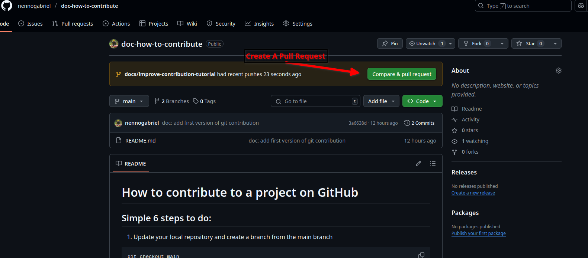
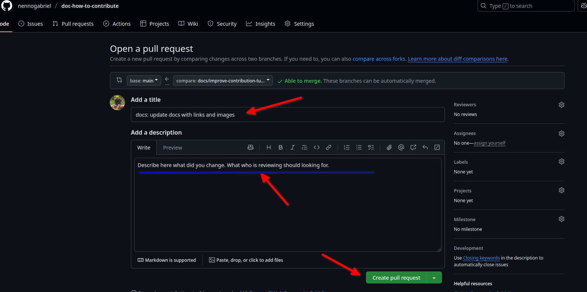

# How to contribute to a project on GitHub

## Simple 7 steps to do:

1. [Update your local repository and create a branch from the main branch](#1-create-a-branch-from-the-main-branch)
   - Use the naming convention: `docs/<what-is-the-change-about>` (lowercase, replace spaces with hyphens)
   - Example: `docs/zigchaind-quickstart-links-fix`

```bash
git checkout main
git pull
git checkout -b docs/your-change-description
```

2. [Make changes in the code](#2-make-changes-in-the-code)

3. [Test your changes locally](#3-test-your-changes-locally)

```bash
npm start
```

4. [Commit your changes](#4-commit-your-changes)

```bash
git add .
git commit -m "docs: message"
```

5. [Push your changes to the branch](#5-push-your-changes-to-the-branch)

```bash
git push origin docs/your-change-description
```

6. [Open a pull request on GitHub](#6-open-a-pull-request-on-github)

7. [Address reviewer comments and wait for merge](#7-address-reviewer-comments-and-wait-for-merge)

# Get deeper into steps

## 0. Setup git environment

First, you need to install git on your machine, you can download it [here](https://git-scm.com/downloads)

```bash
brew install git  # for macOS users
sudo apt install git # for Ubuntu-like users
```

**Why?** Git is the version control system that powers GitHub. Installing it locally allows you to manage code changes, track history, and collaborate with others efficiently.

With git installed, you need to configure your user name and email:

```bash
git config --global user.name "your name"
git config --global user.email "your email"
```

**Why?** Git needs to know who is making changes to track authorship correctly. This information is attached to every commit you make and helps project maintainers identify who contributed what.

Now you are ready to clone a repository and start contributing.

```bash
git clone https://github.com/your-username/your-repo
cd your-repo
npm i  # Install dependencies if it's your first time with the repository
```

**Why?** Cloning creates a local copy of the repository on your machine so you can make changes without affecting the original project until you're ready to share them. Running `npm i` installs all the required dependencies for the project when you're working with it for the first time.

Troubleshooting: If you have problems with SSH keys, you can follow our internal handbook article about [setting up SSH keys](https://app.gitbook.com/o/P49cpcrUNEImf2xtEknS/s/5YQSIGv5ozj0uCmkBoIh/tech/trainings/connect-to-github-with-ssh). This will guide you through the process specific to our workflow.

## 1. Create a branch from the main branch

```bash
git checkout main
git pull
git checkout -b docs/your-change-description
```

**Why?** Before creating a new branch, we switch to the main branch and pull the latest changes. This ensures your new branch starts from the most recent version of the project, minimizing potential conflicts later. Creating a separate branch allows you to make changes without affecting the main codebase.

**Branch naming convention:** For documentation changes, use `docs/<what-is-the-change-about>` with a descriptive name related to your changes. For example:

- `docs/zigchaind-quickstart-links-fix`
- `docs/improve-installation-section`
- `docs/fix-api-examples`

## 2. Make changes in the code

Open your favorite code editor and make the necessary changes to implement your feature or fix the bug.

**Why?** Working in small, focused changes makes your contribution easier to review and less likely to introduce bugs. Try to stick to a single purpose per branch.

**Commit frequently:** Push yourself to commit when you're happy with the result of what you have. Try to reach a satisfactory result soon rather than making one massive change - smaller, focused commits are easier to review and track.

## 3. Test your changes locally

Before committing your changes, it's important to test them locally to ensure they work as expected.

Then start the local development server:

```bash
npm start
```

Then open your browser and navigate to `http://localhost:3000` (or the port specified in your project) to see your changes in action.

**Why?** This command starts a local development server that allows you to see how your documentation changes will look when published. It helps catch formatting issues, broken links, or display problems before submitting your changes.

## 4. Commit your changes

```bash
git add . # this command stages all files changes
git commit -m "docs: short description of changes"
```

**Why?** Commits create savepoints in your code history. The `git add` command stages your changes (prepares them to be committed), and `commit` records them permanently in the repository history with a message describing what you did.

**Using PyCharm:** As an alternative to command line, you can use PyCharm's Git integration:

1. Right-click the changed files in the Project view
2. Select "Git" → "Add" to stage changes
3. Right-click again and select "Git" → "Commit"
4. Enter your commit message following the convention and click "Commit"

**Commit message format:** We follow conventional commits. For documentation changes, use:

- `docs:` for documentation changes

Other common prefixes include:

- `feat:` for new features
- `fix:` for bug fixes
- `style:` for formatting, missing semi-colons, etc.
- `refactor:` for code refactoring
- `test:` for adding tests
- `chore:` for maintenance tasks or unclassified changes

## 5. Push your changes to the branch

```bash
git push origin docs/your-change-description
```

**Why?** Pushing uploads your local commits to GitHub, making them available to others and allowing you to create a pull request. The `origin` refers to the remote repository on GitHub.

## 6. Open a pull request on GitHub

1. Navigate to the repository on GitHub
2. You'll usually see a prompt to "Compare & pull request" for your recently pushed branch
3. Click it and fill out the pull request form with a clear description of your changes
4. Submit the pull request

**Why?** Pull requests notify project maintainers of your proposed changes and initiate the code review process. They provide a forum to discuss your implementation before merging it into the main codebase.

**Include screenshots** when relevant to help reviewers understand your changes, especially for UI or documentation improvements.




## 7. Address reviewer comments and wait for merge

After submitting your pull request, reviewers may provide feedback or request changes:

1. Read all comments carefully
2. Make the requested changes in your local branch
3. Commit and push the updates
4. Respond to the comments indicating that you've addressed them

Be patient and responsive to feedback. The maintainer might request several rounds of changes before accepting your contribution.

**Why?** Code review helps maintain quality and consistency in the project. Maintainers may have insights about project standards or edge cases you hadn't considered.

# Troubleshooting

## Common Git Issues

### 1. Resolving merge conflicts

Conflicts occur when Git can't automatically merge changes:

```bash
git pull origin main
# If you see "CONFLICT" messages:
# Edit the conflicted files manually to resolve
git add .
git commit -m "resolve merge conflicts"
```

**Tip:** Modern code editors like VS Code have tools to help resolve conflicts visually.

### 2. Updating your feature branch with the latest main

If main has been updated while you were working on your branch:

```bash
# Save your current work first
git add .
git commit -m "WIP: save current progress"

# Update with latest main
git checkout main
git pull
git checkout your-branch-name
git merge main

# If there are conflicts, resolve them as above
```

### 3. Accidentally committed to the wrong branch

```bash
# Undo the last commit but keep the changes
git reset HEAD~1
git stash
git checkout correct-branch
git stash pop
git add .
git commit -m "your message"
```

### 4. Need to undo pushed changes

```bash
# Revert the commit but keep history
git revert commit-hash
git push origin branch-name
```

### 5. Permission denied errors

If you see "Permission denied (publickey)" when pushing:

- Ensure your SSH key is properly set up with GitHub
- Refer to our internal handbook [article on SSH key setup](https://app.gitbook.com/o/P49cpcrUNEImf2xtEknS/s/5YQSIGv5ozj0uCmkBoIh/tech/trainings/connect-to-github-with-ssh)
- Try using HTTPS instead with personal access token

### 6. Local branch out of sync with remote

```bash
git fetch origin
git reset --hard origin/branch-name
```

**Warning:** This will discard any unpushed local changes!

Remember: When in doubt, you can always make a backup of your changes before trying complex Git operations.
