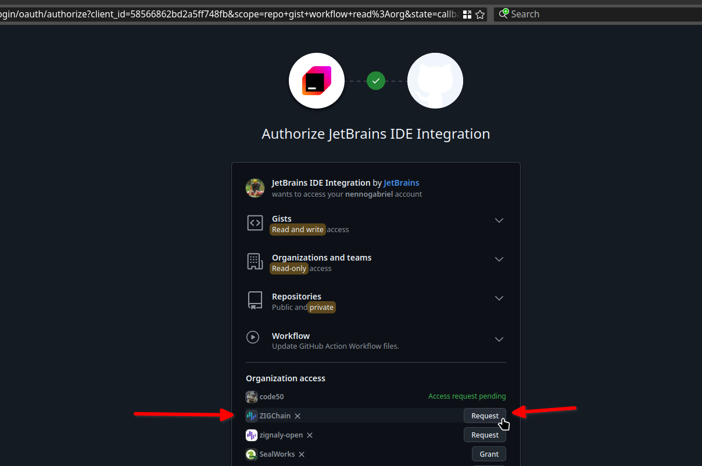

# How to contribute to a project on GitHub using PyCharm

## Simple 6 steps to do:

1. [Update your local repository](#6-wait-for-the-pull-request-to-be-merged) and [create a branch from the main branch](#1-create-a-branch-from-the-main-branch)

   - Use the naming convention: `docs/<what-is-the-change-about>` (lowercase, replace spaces with hyphens)
   - Example: `docs/zigchaind-quickstart-links-fix`

2. [Make changes](#2-make-changes)
3. [Test your changes locally](#3-test-your-changes-locally)
4. [Commit your changes and push](#4-commit-your-changes-and-push)

   - Use the commit message format: `docs: <message>` (lowercase, replace spaces with hyphens)
   - Example: `docs: fix links in quickstart`

5. [Open a pull request on GitHub](#5-open-a-pull-request-on-github)

   - Describe the changes you made if needed
   - Add Asana task link if needed

6. [Wait for the pull request to be merged](#6-wait-for-the-pull-request-to-be-merged)

> **Note:** First time contributing? See the [setup instructions](#0-setup-environment-on-pycharm) to get your environment ready.

## Get deeper into steps

### 0. Setup environment on PyCharm

1. Install PyCharm Community Edition
   - Download and install PyCharm Community Edition from the official website: [PyCharm Community Edition](https://www.jetbrains.com/pycharm/download/)
   - Follow the installation instructions for your operating system.
2. Open PyCharm and go to Open Repository
   
3. Choose GitHub
   
   1. Select GitHub
   2. Login with GitHub
4. Authorize PyCharm
   
   - In the browser, select your account
   - Authorize PyCharm to access your GitHub account
   - Select scopes and request organizations
   - Click Authorize
5. Find the repository
   
   1. Use the search bar to find the repository you want to clone
   2. Select the repository
   3. Click Clone

### 1. Create a branch from the main branch


1. Select the main branch on the top bar
2. Click on "New branch"


1. Write the name of the branch
   - Use the naming convention: `docs/<what-is-the-change-about>` (lowercase, replace spaces with hyphens)
   - Example: `docs/zigchaind-quickstart-links-fix`
2. Click Create

### 2. Make changes

You know what to do here. Just make the changes you want to make in the repository. PyCharm will automatically track the changes you make to the files.

### 3. Test your changes locally

1. Open the terminal in PyCharm
2. Run the command to start the local server (command may vary depending on your project)

```bash
npm start
```

3. Open the browser and go to `localhost:3000` to see your changes
   - Remember to save your files to see the changes in the browser

### 4. Commit your changes and push


1. Select the Git tool on the left bar
2. Select changes you want to commit
   - You can select all changes or specific files
3. Write a commit message
   - Use the commit message format: `docs: <message>` (lowercase, replace spaces with hyphens)
   - Example: `docs: fix links in quickstart`
4. Click Commit or Commit and Push

Forgot to commit and push on final change?
No problem, you can do it later:


1. Select the branch on the top bar
2. Click on "Push"
   - You can also use the shortcut `Ctrl + Shift + K` to push


1. Select the branch you want to push
2. Click on "Push"

### 5. Open a pull request on GitHub


When you push your changes, PyCharm will show you a quick link to open a pull request on GitHub.

Missed it? No problem, you can do it later:


1. Click on the hamburger menu in the top left
2. Select `Git`
3. Select `GitHub`
4. Select `Create Pull Request`


1. Add a title and description for your pull request
   - Describe the changes you made if needed
   - Add Asana task link if needed
2. Click on "Create Pull Request"

### 6. Wait for the pull request to be merged


After your PR is merged:

1. Select the branch dropdown on the top bar
2. Select local main branch
   - This could be tricky: select first, then repeat the 1st step to update the right branch
3. Click on "Update"

**Why update the main branch?**
It's important to always start from the latest version of the main branch to avoid merge conflicts. Remember to do this before creating a new branch for your next contribution.
